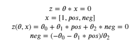

# First concepts
 * **tokenizing** : remplacer les mots par un index
 * **frequency dictionnary** : un tableau dans lequel à 2 colonnes dans lequel chaque ligne correspond à un mot du vocabulaire, les colonnes A et B représentent les fréquences des mots dans les classes A et B
 * **features extraction** : tu peux représenter un document avec seulement 3 features : 
   1. Le biais : valeur 1
   2. La somme des fréquences positives des mots contenus dans le document
   3. La somme des fréquences négatives des mots contenus dans le document

***

# Preprocessing
 * **Remove stop words and punctuation** : que du classique, tu removes les mots trop fréquents, et la ponctuation. Attention toutefois, dans certains cas particuliers, tu veux garder la ponctuation. Dans le cas des tweets, tu veux également enlever les *handls* et les *urls*
 * **stemming** : bon en gros tu prends que la racine des mots plutot que les mots eux mêmes. Ca permet de réduire la taille du vocabulaire
 * **lowercasing** : tu passes tout le texte en lowercase

***

# Ungraded Lab

## General
 * Pour printer en vert : `print('\033[92m' + 'salut')`
 * Afin d'importer les stops words sur nltk : `nltk.download('stopwords')` + `from nltk.corpus import stopwords`

## Tokenizer
 * Importer le module : `from nltk.tokenize import TweetTokenizer`
 * Instancier le tokenizer : `tokenizer = TweetTokenizer(preserve_case=False, strip_handles=True,reduce_len=True)`
 * Tokenizer les tweets : `tweet_tokens = tokenizer.tokenize(tweet2)`
 * L'objet `tweet_tokens` contient tout les tokens du Vocabulary

## Stemmer
 * Instancier le stemmer : `stemmer = PorterStemmer()`
 * Pour stemmer un mot : `stemmer.stem(word)`

## Features Matrix
Donc pour lui, la construction de la features matrix doit se faire de la façon suivante : 
 1. Il compute le frequency dictionnary
 2. Il initialise une matrice vide de taille m,n avec m = le nombre de tweets et n = 3
 3. Il boucle sur chaque tweet, il le process pour n'en ressortir qu'une liste
 4. Puis pour chaque liste, il en ressort le vecteur de features de taille 3
 5. Puis il remplit une ligne de la matrice

## Représentation visuelle

### Les mots
On peut représenter visuellement la polarité des mots du vocabulaire en plottant le log de leurs coordonnées dans l'espace des features nouvellement créées, i.e. (*nombre de documents positifs contenant le mot X, nombre de documents négatifs contenant le mot X*) :

### Les tweets
De la même façon, on peut représenter les documents sur ce plan. Chaque document est représenté par le vecteur de taille 3. Mais on peut décider de n'afficher que les deux features pos et neg. Ca donne le plot ci-dessus :

***

# Régression logistique

 * **Le modèle** : bon classique, la somme pondérée + une constante, squashed entre 0 et 1 grace à la fonction sigmoide

 * **La cost function** : la binary cross entropy, classique

* **Méthode du gradient descent** : bon comme d'habitude

***

# Résolution, autre façon

Donc en fait, comme tu peux représenter un document en seulement 3 dimensions, tu peux faire une espèce de résolution graphique. En affichant les documents sur un plan, (en omettant le biais), tu peux vouloir chercher l'équation de la decision boundary. 

 * **Decision boundary** :

* **Direction** : apparemment, ils veulent pouvoir sortir le vecteur perpendiculaire à la decision boundary. Pour ça, j'ai l'impression qu'ils ne s'emmerdent pas. *pos* en fait c'est juste l'équivalent de x:

***

# Evaluation du modèle

Bon là, dans les cas où le dataset est bien balanced, l'**accuracy** est une métrique correct pour évaluer le modèle. Celle-ci s'écrit de la manière suivante : 

