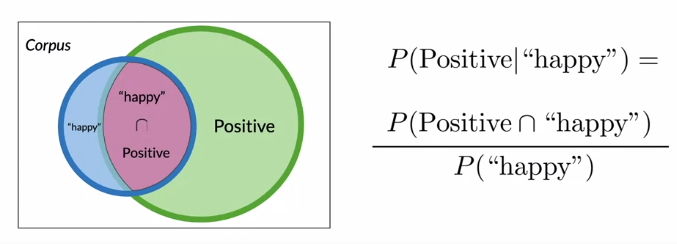
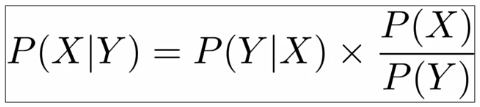
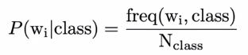
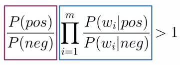
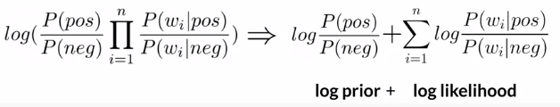
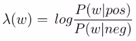
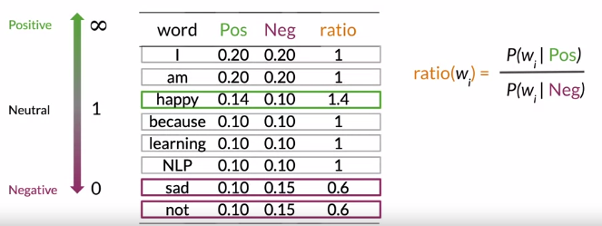
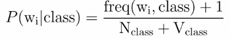
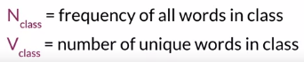
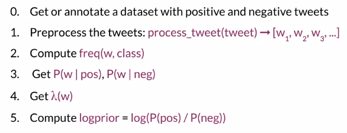

# Bayes theorem

***

# Naive Bayes Classifier

 * **Step 0, calcul des occurences** : Pour chaque mot, on compte le nombre de documents positifs qui contient ce mot. Puis on compte le nombre de documents négatifs qui le contient. Par exemple le mot *happy* apparaît dans 50 documents positifs et dans 15 documents négatifs

 * **Step 1, calcul des probabilités conditionnelles** : On calcule les probabilités conditionnelles de chaque mot. Pour le mot *happy*, on va calculer P(happy|Positif) et P(happy|Negatif) comme le montre l'illustration ci-dessous : 

 * **Step 2, likelihood** : cette métrique permet de classer un document. Il s'agit du produit des rapport des probabilités conditionnelles des mots qui constituent le document. Plus la NBIR est élevée, plus il est probable que le document soit positif. Le premier terme représente ce qu'on appelle la *prior*. Ce terme est égal à 1 dans le cas de dataset équilibré parfaitement :

* **Step 3, log-likelihood** : la vraisemblance est un produit de valeurs numériques pouvant être très nombreuses comprises entre 0 et 1. Pour des raisons informatiques, il se peut que l'on perdre de l'information lors des arrondis de valeurs avec un grand nombre de décimales (réduction du risque d'underflow). On préfère donc utiliser le logarithme de la vraisemblance pour ces raisons là. A ce moment là, on préfère calculer ce qu'on appelle le lambda de chaque mot. Il est égal au log du rapport des probabilités conditionnelles

***

# Notions

 * **ratio, power words** :  sont les mots qui permettent de discriminer. Formellement, ce sont des mots pour lesquelles le rapport entre les probabilités conditionnelles est éloigné de 1. `P(happy|+) / P(happy|-) >> 1`

 * **Laplacian Smoothing** : les mots qui n'apparaissent pas dans une classe nous posent problème lors du calcul de la NBIR. C'est la raison pour laquelle, on préfère un calcul des probabilités conditionnelles un peu particulier. Le Laplacian Smoothing : 

***

# Naïve Bayes Classifier, le résumé
Voici les différentes steps à suivre pour construire un modèle de bayes :

***

# Les drawbacks du Bayes Classifier

 * **Naïf?** : On le dit Naïve parce qu'il part de l'hypothèse que toutes les features du modèle sont indépendantes, ce qui n'est en pratique jamais le cas

 * **Problème des classes relatives** : la prédiction d'un NBC dépend beaucoup de l'équilibre des classes du training set. Ce qui pose un problème car celui-ci est souvent 50/50. Il est important de choisir un training set représentatif des documents que l'on va souhaiter classer car la prior joue un rôle important