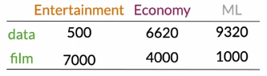
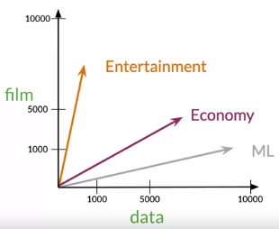
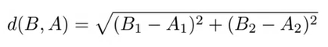
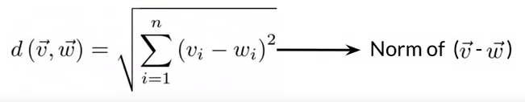
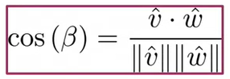

# Word embeddings

***

## Word representation

Il s'agit de représenter ou bien un mot par un vector. On peut faire ça de deux manières possibles : 

 1. **Word by word design** : on représente le mot par la fréquence des autres mots du vocabulaire présent dans son voisinage. Il y a un paramètre `k`, qui représente la taille du voisinage. Si `k=2`, alors ca veut dire que le voisinage du mot W est défini tout les mots situés à une distance d'au plus 2 mots de W. La co-occurence matrix représente pour le vector space model de chaque mot (en ligne)

 2. **Word by document design** : on dispose d'une collection de documents. Chaque document appartient à une classe C. On représente un mot du vocabulaire par le nombre de documents contenant le mot pour chaque classe existante. On peut ensuite représenter les classes par plusieurs vecteurs comme suit : 

<p align="center">

</p>


<p align="center">

</p>


***

## Numpy Array, Basics

 * Avec m, une matrice numpy array
 * Afin d'appliquer une opération sur chacun des elements d'une matrice : `m * 2`, `m + 2`, `m - m`
 * Afin de prendre la transposée : `m.T`
 * Afin de calculer la norme d'un array (en gros la distance) : `np.linalg.norm(vecteur)`
 * Afin de calculer les normes colonnes d'une matrice : `np.linalg.norm(m,axis=0)`
 * Afin de calculer les normes lignes d'une matrice : `np.linalg.norm(m,axis=1)`
 * Avec a,b deux arrays, afin de faire un *dot product* :
    * `np.dot(a,b)` ... préférable car il peut prendre des listes en arguments
    * `a @ b`
    * `a.dot(b)`
 * Afin de sommer, ou de prendre la moyenne sur les éléments d'un array :
    * `np.sum(a,axis=0)` ... les éléments d'une colonne
    * `np.sum(a,axis=1)` ... les éléments d'une ligne
    * `np.mean()` ... pareil mais pour la moyenne

***

## Euclidean Distance

 * Représente la distance entre deux points A et B. Pour les vecteurs en 2 dimensions :

<p align="center">

</p>

 * Généralisation de la distance euclidienne à n dimensions. Il se trouve que la distance euclidienne entre deux vecteurs v et w, est égale à la norme du vecteur v-w :

<p align="center">

</p>

***

## Cosine similarity

Il se trouve que la distanc euclidienne n'est pas toujours la meilleure façon de comparer deux vecteurs. Parfois on lui préfère la cosine similarity. Il s'agit de calculer l'angle entre les deux vecteurs. La cosine similarity entre a et b est le rapport entre le dot product de a et b et le produit des normes de a et b. C'est une similarité :
 * cosine(a,b) = 0 ... *Alors a et b très différents*
 * cosine(a,b) = 1 ... *Alors a et b très proches*

<p align="center">

</p>

***

## PCA

#### Algorithme

bon alors l'idée est la suivante : afin de vérifier que l'embedding de plusieurs mots a bien capturé la signification des mots, on peut avoir envie de les représenter dans un plan en 2 dimensions. A ce moment là, la meilleure façon de faire est de chopper les axes qui vont préserver la plus grande part de variance disponible. C'est la PCA. Voici les différents steps à suivre pour performer une pca :
 1. Centrer réduire les données
 2. Computer la matrice de covariance. Chaque élément correspond à la covariance entre deux features. C'est une matrice symétrique
 3. Perform une SVD afin de trouver les 2 matrices, (1, la matrice U) matrice colonnes de eigen vectors, (2, ma matrice S) matrice diagonale des eigen values,
 4. Calculer les nouvelles coordonnées en faisant XU avec X la matrice des données. Ensuite on garde les 2 premières colonnes pour représenter les observations en deux dimensions
 5. Eventuellement tu peux avoir envie de calculer la proportion de variance contenue sur les deux axes retenues. C'est égale à la somme des éléments des 2 premiers éléments de la diagonale de S sur l'ensemble des éléments de la diagonale de S. Il faut quand même s'assurer que les eigen values ont été ordonnées dans la matrice S


#### Python

```
from sklearn.decomposition import PCA
pca = PCA(n_components=2) # instanciation de la pca, on veut conserver les deux premiers axes
pcatr = pca.fit(data) # data est une matrix m,n centrée réduite, ici on run la pca dont les résultats sont contenues dans pcatr
newdata = pcatr.transform(data) # on calcule les nouvelles coordonnées des points
```