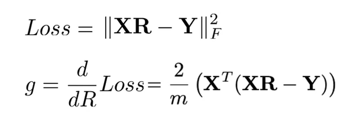

# Word Translation

## Introduction
L'idée est assez simple, on veut pouvoir traduire un mot dans une langue dans une autre langue. Autrement dit, on veut partir d'un embedding et en arriver à un autre. On cherche donc une transformation qui minimisera l'erreur.
La transformation la plus simple est la transformation linéaire et c'est celle qu'on va utiliser.

## Formalisation du problème
Soit X, une matrice de m mots et n features dans une langue "a". Soit Y, une matrice de m mots et n features contenant les mêmes mots que X et ordonnés de la même façon. On cherche R de taille (n,n) tel que la norme de Froebinus au carré de [XR-Y] soit minimum.

## Norme de Froebinius

## Gradient descent

Afin de trouver R, on procède avec un gradient descent :
 1. Initialisation de R
 2. Calcul de la Loss
 3. Calcul du Gradient
 4. Mise à jour du gradient

## Loss et calcul du gradient

## Numpy

 Mettre les éléments d'une matrice au carré : `np.square(A)`

## Hash tables

 * **Hash function** : une fonction qui prend un array et qui recrache une hash value
 * **Hash value** : valeur numérique représentant un bucket
 * **Hash table** : l'ensemble des buckets
