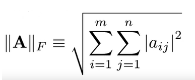
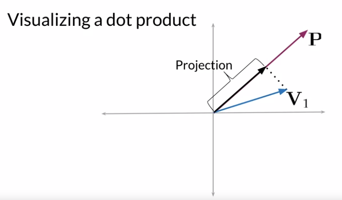
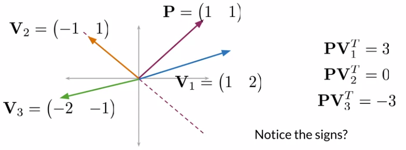
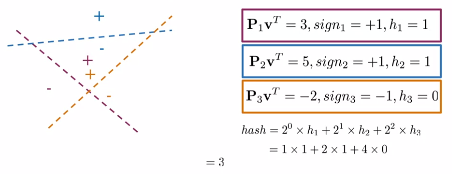

# Word Translation

***

## Introduction
L'idée est assez simple, on veut pouvoir traduire un mot dans une langue dans une autre langue. Autrement dit, on veut partir d'un embedding et en arriver à un autre. On cherche donc une transformation qui minimisera l'erreur.
La transformation la plus simple est la transformation linéaire et c'est celle qu'on va utiliser.

## Formalisation du problème
Soit X, une matrice de m mots et n features dans une langue "a". Soit Y, une matrice de m mots et n features contenant les mêmes mots que X et ordonnés de la même façon. On cherche R de taille (n,n) tel que la norme de Froebinus au carré de [XR-Y] soit minimum.

## Norme de Froebinius

## Gradient descent

Afin de trouver R, on procède avec un gradient descent :
 1. Initialisation de R
 2. Calcul de la Loss
 3. Calcul du Gradient
 4. Mise à jour du gradient

## Loss et calcul du gradient

## Numpy

 Mettre les éléments d'une matrice au carré : `np.square(A)`

***

# Approximate K-nearest Neighbors

## Idée générale
En pratique ce qu'on fait c'est qu'on génère les vecteurs normaux de plans qui vont divisier l'espace. Puis Pour chaque observation, on va calculer l'ensemble des "signes" avec chaque plan et enfin en extraire une hash value. Ensuite ca nous permet de ...

## Hash tables

 * **Hash function** : une fonction qui prend un array et qui recrache une hash value
 * **Hash value** : valeur numérique représentant un bucket
 * **Hash table** : l'ensemble des buckets

## Document représentation
Bon là c'est simple tu peux représenter un document par la somme des embeddings des mots qui le composent

## Interprétation d'un dot product
On peut voir le dot product entre deux vectors par la projection orthogonale du plus petit vecteur sur le plus grand

## Position relative d'un point par rapport à un axe
On peut se servir du dot product pour savoir si un point se situe d'un côté ou de l'autre d'un axe. Si le dot product du vecteur normal de l'axe et le vecteur qui identifie le point est positif, alors le point se situe dans la partie supérieur du plan défini par l'axe. S'il est négatif alors il se situe dans la partie inférieur. Dans l'illustration ci-dessous, le plan est défini par l'axe en pointillé et le vecteur normal au plan est P (violet)

## Division de l'espace et hash value
En divisant l'espace en plusieurs plans (axes) puis en calculant le dot product d'un vecteur v avec les différents vecteurs normals des plans, on peut avoir une idée d'où se situe le point v. En prenant le signe des dot product, on sait dans quel région, il se situe. On veut assigner à ce set de signes une seule valeur (la hash value). Lorsque le signe du dot product>0, on assigne la value à 1. Lorsque le signe du dot product<0, on assigne la value -1. Ensuite la hash value du set vaut la somme des 2^i * hi. Avec hi les value.

***

# Résumé du process

