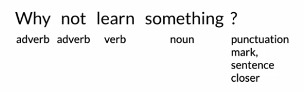
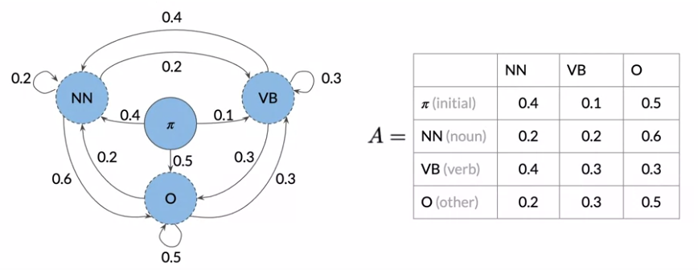
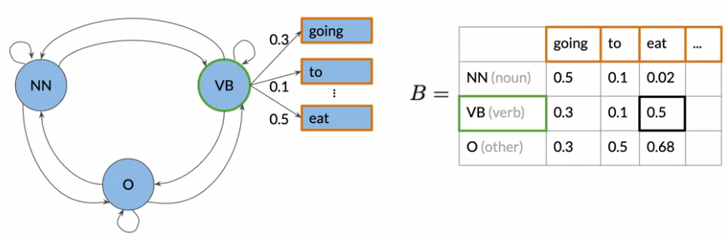
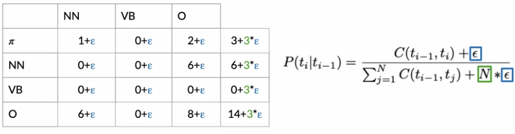
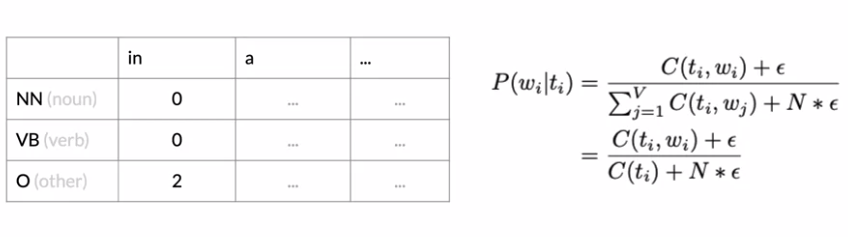

# Part of speech tagging

## Definition

En gros c'est catégoriser les mots grammaticalement, si je comprends bien. Ca peut servir à plusieurs tâches de NLP :
 * *coreference resolution*
 * *named entities resolution*

## Markov chains

Des ensembles de probabilités pour passer d'un "state" à un autre. On le représente le plus souvent sous forme de graph. La survenue d'un événement dépend toujours de l'événement précédent. Dans le cadre du POS tagging, ça t'informe sur les probabilités d'avoir consécutivement un nom et un verbe par exemple. On peut représenter une markov chain ou bien graphiquement ou bien via ce qu'on appelle la transition matrix. Celle-ci n'est **pas symétrique**. Généralement, on rajoute un état initial dans la markov chain pour représenter le début d'une phrase. A ce moment là, **la matrice n'est plus carré**, mais de dimension (n+1,n) avec n le nombre d'états possibles.

 * *NN* : nom
 * *VB* : verbe
 * *O* : others

## Hidden Markov Models

Bon en fait, on part du principe que les états observent des réalisations. Par exemple, l'état VB peut observer 50% du mot "EAT". Donc on peut construire la matrice des emissions qui représentent pour chaque état, ses propres observations.

## En pratique

En pratique on utilise une smoothing transition matrix comme suit. **Attention** ceci dit on ne veut pas smoother la premiere ligne, car on ne veut pas qu'une phrase puisse commencer par une ponctuation par exemple.

Le même esprit pour la matrice des emissions

