# Language model

Un modèl qui prédit le mot qui vient sachant le début de la phrase ou bien le corpus entier. Ca sert dans une mutltiude d'applications :
 * *speech recognition*
 * *auto complete*
 * *spelling correction*

# N grams
Les sets de N mots qui se suivent dans une phrase ou un corpus

## Introduction de N gram probability

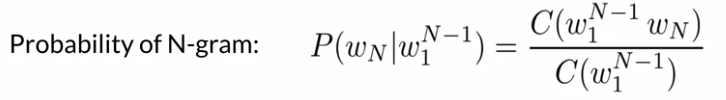

## Probability of a sequence

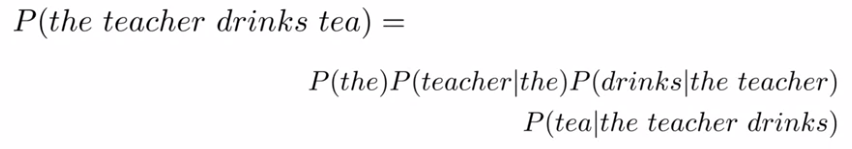

## Probability of a sequence, approximation
En pratique, il est très difficile d'obtenir certaines probabilités conditionnelles intermédiaires. Pour calculer la probabilité de la séquence **"J'aime bien boire du thé glacé l'été"**. Il est très peu probable que la séquence de mots **"J'aime bien boire du thé glacé l'"** n'est pas forcément présent dans le corpus d'entraînement.  Dans ces cas là, on calcule ce qu'on appelle une approximation de la probabilité :

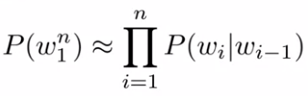

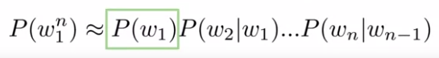

# Start and End sentence signs
Pour calculer les probabilités conditionnelles des mots se trouvant au début des phrases, on manque généralement de contexte (pas assez de mots précédents). Pour parer à ce problème, on rajoute en début de phrases autant de start tokens, **< s >** que nécessaire. De la meuf façon, on rajoute un ending token à la fin de chaque phrase, **< / s >**

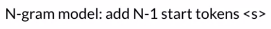

# Process d'un language model

## Count Matrix
Représente l'ensemble des occurences des Ngram, dernier mot | N-1 derniers mots
 * En ligne : toutes les séquences de N-1 derniers mots
 * En colonne : tout les mots du vocabulaire
 * Valeur : F(mot|derniers N-1 mots)

## Probability matrix
Représente l'ensemble des probabilité des Ngram P(Wn|Les N-1 derniers mots)
 * En ligne : toutes les séquences de N-1 derniers mots
 * En colonne : tout les mots du vocabulaire
 * Valeur : P(mot|derniers N-1 mots)

## Language model
Une fois qu'on a la probability matrix, on peut calculer la probabilité de n'importe quelle suite de mots ou bien la probabilité d'un mot sachant les N précédents mots. Bon, évidemment on préfère prendre la somme des logs des proba,
plutot que de prendre le produit des proba pour éviter les risques d'underflow.

## Generative model
Bon en gros c'est un modèle qui va construire des phrases tout seul en piochant les Ngrams un à un jusqu'à arriver au ending token.

# Perplexity
Une  métrique pour évaluer la performance d'un language model. On rappel un language model assigne des probabilités à chaque phrase. Le procédé est toujours le même, on divise son dataset en trois. la façon de le diviser dépend, on peut choisir une méthode documents par documents, ou bien on peut mélanger toutes les phrases.
 * training set : 80-98%, smaller to larger corpora : training models
 * validation : 10-1% : pick up the best model
 * test : 10-1% : evaluate model

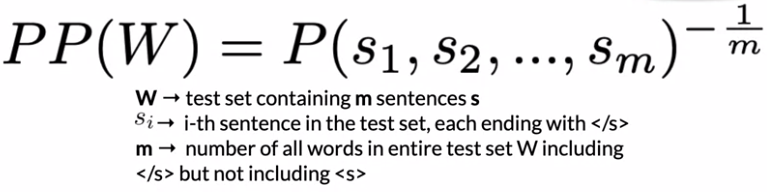

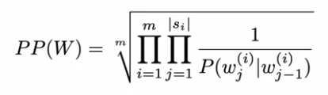

En gros, il s'aggit de mesurer la *vraisemblance* des *phrases générées* dans le test set. Plus la perplexité est faible, meilleur est le modèle. Les meilleurs modèles ont des perplexités inférieures à 20. Pour les Ngram models, plus N est grand, meilleur est la perplexité.

# Log Perplexité

Pour éviter les risques de underflow (enfin je crois), on préfère utiliser la log-perplexité. Les meilleurs language models ont des log perpléxité comprises entre 4.3 et 5.9

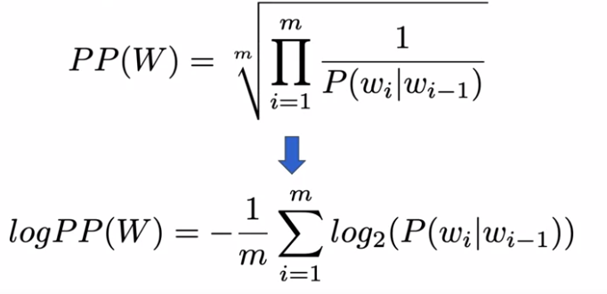

# Out-of-vocabulary words
Les mots qui n'ont pas été vus par le modèle lors du training. Pour adresser ce problème, en pratique on peut faire une des choses suivantes :
 * Set une fréquence threshold f, tout les mots dont la fréquence dans le training set est inférieure à f sont réécrits en **<UNK>**
 * On définit une taille de vocabulaire V, on rank tout les mots en fonction de leur fréquence et on garde le top V des mots

Cependant, il y a deux remarques importantes à prendre en compte :
 1. lorsque le nombre de **<UNK>** est trop élevé, **la perplexité a tendance à baisser**, donc il faut faire attention lors de l'évaluation du modèle à ne pas s'enflammer, il ne faut pas utiliser des seuils trop lâches lors
de la défnition des **<UNK>** dans le training set
 2. Quand on compare deux language models, attention à ne comparer uniquement des modèles qui contiennent **le même vocabulaire** du training set

# Probabilités nulles, solution

## Smoothing

Afin d'éviter les probabilités conditionnelles égales à zéro, on applique un **Laplacian Smoothing** lors du calcul de la vraisemblance des phrases. Dans le cadre de corpus important, on préfère utiliser le add-k smoothing qui est en fait une généralisation du Laplacian smoothing. Il existe d'autres méthodes de smoothing comme Kneser-Ney et Good-Turing

#### Laplacian Smoothing

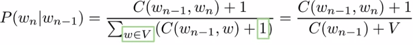

#### Add-K Smoothing

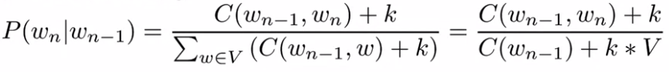

## Backoff

Donc là, on s'emmerde pas, si on a pas la probabilité pour un NGram donné. On prend le N-1 Gram et on multiplie par une constante :

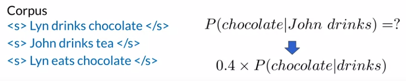

## Interpolation

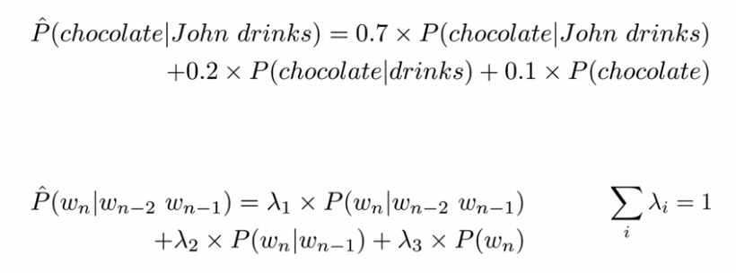

